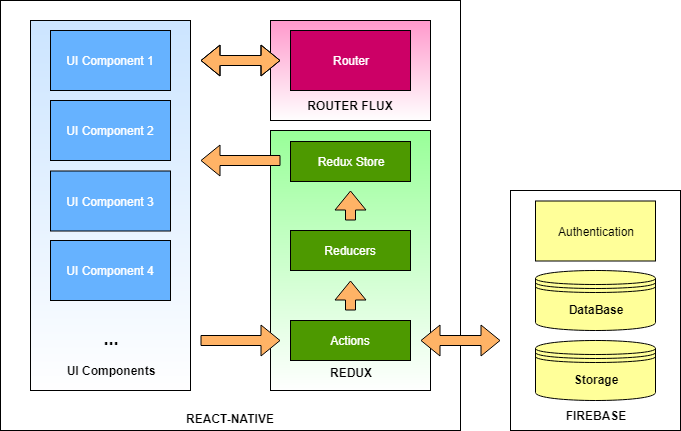

<p align="center">
    
</p>
<br />
<p align="center" style="margin: auto; padding: 10px;">
    <a href="https://github.com/facebook/react-native">
        
    </a>
    <a href="https://expo.io/">
        
    </a>
    <a href="https://github.com/aksonov/react-native-router-flux">
        Router Flux
    </a>
    <a href="https://github.com/react-native-training/react-native-elements">
        
    </a>
    <a href="https://github.com/reactjs/redux">
        
    </a>
    <a href="https://firebase.google.com/">
        
    </a>
</p>

<h1 align="center">
  Nihon-GO
</h3>

### Introduction
Nihon-GO is a Social travel application for foreigners travelling to Japan. Users can find,
share and use experiences in the form of itineraries. It features an interactive map of
Japan that allows users to explore regions in Japan, an itinerary system that allows
users to create and use itineraries, and a profile system that allows users to track
itineraries they create, start and favorite.

### The Current System
The project was a newly created project with no previous code. For this reason, our
main goal was to create an application with core features and functionalities that also
has the capability to scale as it continues to grow.

The core features that were implemented were: 
* Creating and publishing itineraries
* Viewing itineraries
* Editable user profile
* Upload pictures
* Favoriting Itineraries
* Starting Itineraries
* Manage user created itineraries and Favorited Itineraries
* Drawer menu for navigation
* Guide section. 
* Map of Japan for exploring regions
* Filtering funtionality

All implemented features demonstrate the core functionality of the system at a basic level. Google's Material Design was used as a standard for the the UI/UX design. This allows the app to be intuitive and compact. 

### Architecture

The application uses a combination of React Native, React-Redux, React Native Router Flux, and firebase as a database, data store, and authentication service. This architecture separates UI, application logic in actions, application state (data) in the redux store, view switching in the router, and firebase services. 

<br />
<p align="center">
    
</p>
<br />

The flow of the application is as follows: UI components call Redux Actions. Redux actions perform queries on the firebase database, store and retrieve files in the firebase storage, and authenticates users through firebase. These Redux Actions also call Redux Reducers. Reducers modify the application state and store the state in the Redux Store. The Redux Store listens for changes in the application state. When the application state changes, the Redux Store rerenders UI components reliant on the application state.

# Installation

### Requirements:
* [Node.js](https://nodejs.org/en/) needs to be installed with npm in order to build and run the app.
* [Expo app](https://play.google.com/store/apps/details?id=host.exp.exponent&hl=en_US) needs to be installed on a mobile device to use the Nihon-GO if not using a virtual device
* The system is in the "Nihon-GO-1.0\Code\Nihon-GO_App" directory.
* The app will run on IOS but was optimized for Android

---

To make sure all the correct modules are installed run:
```markdown
npm install
```
To build and run the app:
```markdown
npm start
```

A QR code will appear and is used with the Expo app run the app

# Sample app

Run this QR code on the expo app to use a working build of the app:

</br>
<p>
    
</p>

